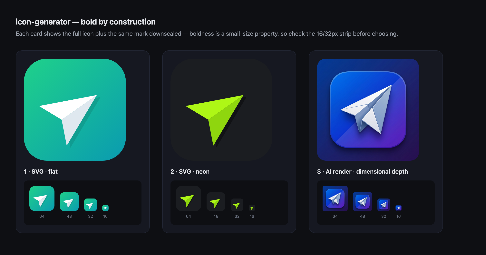

# icon-generator

> A [Claude](https://claude.com/claude-code) skill that generates visually **bold**, instantly-legible project icons, app icons, and favicons — vector-first, with optional AI rendering.



Most AI-generated icons come back weak: a thin line drawing floating on white that looks fine at 1024px and vanishes at 16px — the size a favicon actually renders at. `icon-generator` is built to avoid exactly that. It produces marks that are **bold by construction** and stay legible when small, then slices the chosen one into a complete, drop-in favicon set.

## How it works

**SVG-first, escalate only when needed.** Most project marks are simple — a glyph, a letterform, a geometric symbol — and for those a hand-authored SVG beats a generated raster: bold by construction (solid fills, thick shapes), razor-sharp at every size, a few hundred bytes, free, instant, and editable. SVG is also the modern primary favicon format.

It escalates to **AI rendering** ([Higgsfield](https://higgsfield.ai) Nano Banana Pro) only for the jobs vector can't fake — dimensional, glossy, or illustrative looks (think a macOS-style icon with real depth and material).

The whole skill is organised around 8 "bold-icon" principles:

1. **One shape, one idea** — a single, instantly-readable motif.
2. **Fill over line** — solid forms and thick strokes; thin hairlines disintegrate when downscaled.
3. **High figure/ground contrast** — the silhouette must pop when you squint.
4. **Full-bleed container** — a rounded-square tile whose background fills the entire frame, never floating on white.
5. **Big, centered, generous padding** — the motif fills ~62–70% of the tile.
6. **Confident, limited palette** — one dominant colour + one accent, saturated.
7. **Flat or subtly dimensional** — never photoreal noise that won't survive downscaling.
8. **No text** — except a single bold monogram.

## Install

Clone into your Claude skills directory:

```bash
git clone https://github.com/jagypus/icon-generator.git ~/.claude/skills/icon-generator
```

Then just ask Claude, in any project.

## Usage

In natural language — the skill triggers on requests like:

> “make me an icon for my project”
> “generate a favicon for my site”
> “design an app icon — something bold and dark”
> “this icon looks weak, make it stronger”

What happens: a quick brief → 2–3 SVG concepts → a contact sheet opens in your browser to choose → (optionally escalate to AI rendering for a dimensional look) → the chosen master is sliced into the full set.

## What you get

A complete, drop-in favicon / app-icon set:

| File | Purpose |
|------|---------|
| `favicon.svg` | primary favicon — vector, crisp at any size |
| `favicon.ico` | 16/32/48 multi-res, legacy browsers |
| `favicon-16/32/48/64.png` | browser tabs |
| `apple-touch-icon.png` (180) | iOS home screen |
| `icon-192.png`, `icon-512.png` | PWA / Android |
| `icon-1024.png` | master / App Store source |
| `site.webmanifest` + `head.html` | manifest + paste-ready `<head>` tags |

## Scripts

Both run standalone, no pip installs:

- **`scripts/make_favicons.py`** — turns one master (`.svg` or `.png`) into the full set above. Uses `sips` for resizing, a pure-Python ICO packer, and `qlmanage`/Chrome to rasterize SVG.
  ```bash
  python3 scripts/make_favicons.py my-icon.svg --out-dir favicons --name "MyApp"
  ```
- **`scripts/make_contact_sheet.py`** — builds a self-contained HTML contact sheet of concepts (each shown large plus a 16/32/48/64px strip, so you can judge small-size legibility) and opens it in your browser.
  ```bash
  python3 scripts/make_contact_sheet.py a.svg b.svg c.png --title "Concepts"
  ```
- **`scripts/contrast_check.py`** — WCAG luminance contrast ratio between a mark and its tile, so the mark is verified to *pop* before you ship it. An icon needs a higher bar than text (aim ≥7, ideally ≥10) — a mid-tone mark on a dark tile passes for text yet reads muddy small.
  ```bash
  python3 scripts/contrast_check.py "#ffffff" "#0a9bb0"
  ```

## Requirements

- **macOS** — the favicon pipeline uses built-in `sips` (resize) and `qlmanage` (SVG→PNG). Google Chrome and ImageMagick are used as fallbacks if present.
- **Python 3** — standard library only.
- **Generative path only:** the [Higgsfield CLI](https://higgsfield.ai) + an account. The SVG-first path needs neither.

## License

MIT © 2026 David Hodgson
